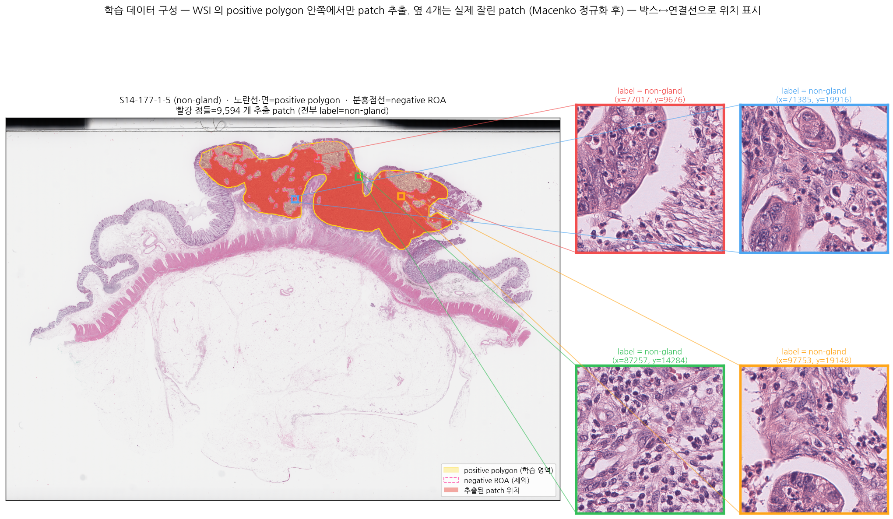
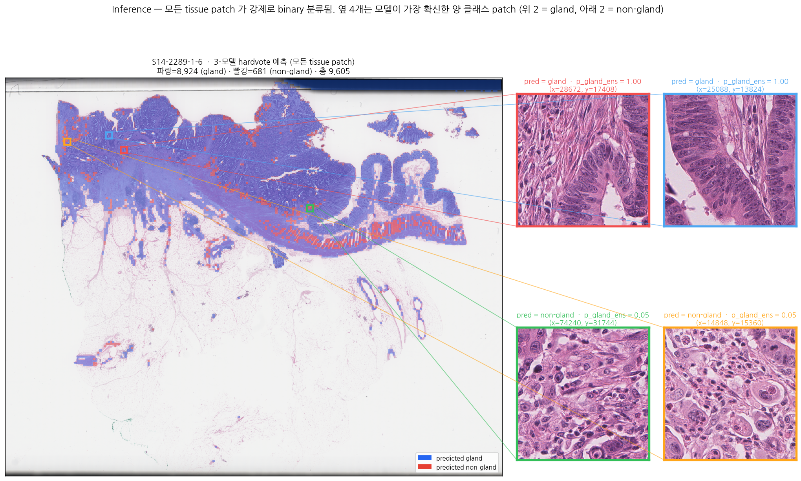
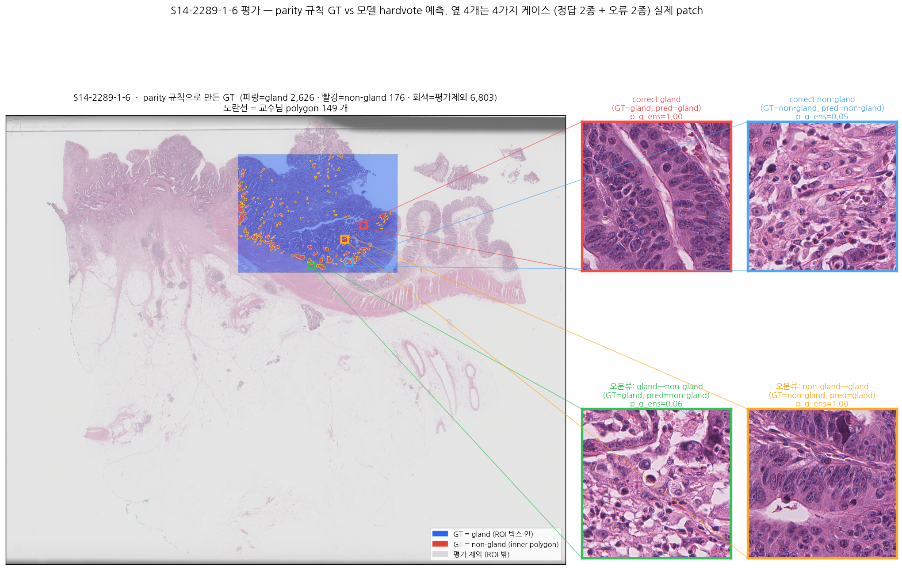

# Pipeline scenario — gland vs non-gland binary classification

각 figure 는 PPT 스타일 zoom-in: 왼쪽 WSI 위에 색상 박스(확대된 위치)를 그리고,
오른쪽에 그 위치의 실제 patch 가 동일 색상 테두리로 표시됩니다. 박스↔patch 가 연결선으로 매핑.

---

## 1. 학습 데이터 구성 — `fig1_training_pipeline.png`



- 학습 슬라이드 1장 = **한 가지 class** (파일명 `_S` = non-gland, `_G` = gland).
- 교수님이 그 class 영역만 polygon(positive, 노란선)으로 표시. 안의 작은 negative ROA (분홍 점선)는 제외.
- 노란 영역 안에서 sliding window (patch 512, stride 256) → mask_ratio ≥ 0.5 인 곳만 채택.
- 영역 밖 normal tissue 는 **학습 데이터에서 빠짐**.
- 4개 색상 박스 = 임의로 뽑은 patch 위치, 옆에 실제 잘린 patch (Macenko 정규화 후) 보여줌.

---

## 2. Inference — `fig2_inference_flow.png`



- 외부 슬라이드 (S14-2289-1-6, 121,511×97,566 px) 전체에 stride 512 sliding.
- tissue 가 있는 패치만 후보 — 9,605 개.
- 각 patch → Macenko → 224 resize → 3 모델 forward → hardvote → **gland/non-gland 둘 중 하나로 강제 분류**.
- 4개 callout = 가장 확신한 gland 2개 + 가장 확신한 non-gland 2개.

---

## 3. S14-2289-1-6 평가 — `fig3_gt_parity_rule.png`



교수님 안내: *"큰 네모 박스로 영역을 지정했고요, 그 안에서 annotation 한 것이 non-gland cancer, 나머지는 gland cancer + 일부 normal."*

XML 안 149 polygon 에서 parity 규칙 ([compute_gt_metrics.py:78](Gland_Seg/Code/compute_gt_metrics.py#L78)):

```
patch 중심이 들어 있는 polygon 수 →
  0개 (ROI 밖)        → 평가 제외 (회색)
  1개 (ROI 박스 안만) → GT = gland (파랑)  ← *normal tissue 도 여기 포함됨*
  2개 이상 (inner)    → GT = non-gland (빨강)
```

4개 callout = 4가지 분류 결과 (정답 2종 + 오분류 2종) 실제 patch.

---

## 자주 헷갈리는 포인트

| 질문 | 답 |
|---|---|
| normal 도 분류하나? | 아니요 — 모델은 항상 binary. normal tissue 도 gland/non-gland 중 하나로 예측됨 |
| 학습은 무엇을 보고 하나? | 슬라이드의 positive polygon 안쪽 패치만. 영역 밖 normal 은 학습 안 함 |
| GT 의 normal 처리? | S14-2289-1-6 GT 에서 normal 은 gland 와 같이 label 0 으로 묶임 — gland F1 가 약간 너그러움 |
| 왜 평가 patch 가 9,605 보다 적나? | parity 규칙으로 GT 부여된 patch (ROI 안) 만 평가 → ~2,800 |
| non-gland F1 낮은 이유? | (i) 학습 클래스 불균형, (ii) non-gland 패턴 다양성 부족 |

생성 스크립트: [viz_pipeline_scenario.py](../../Code/viz_pipeline_scenario.py)
